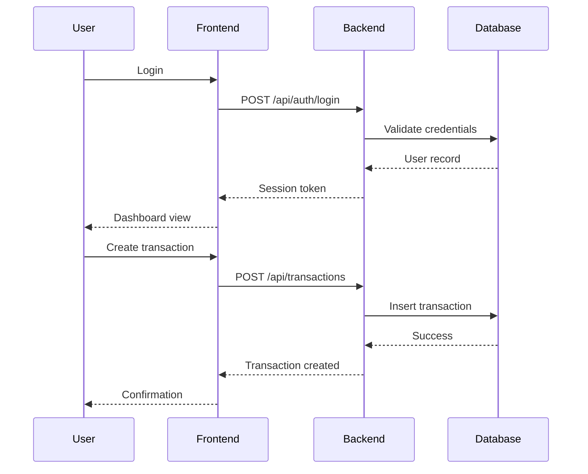
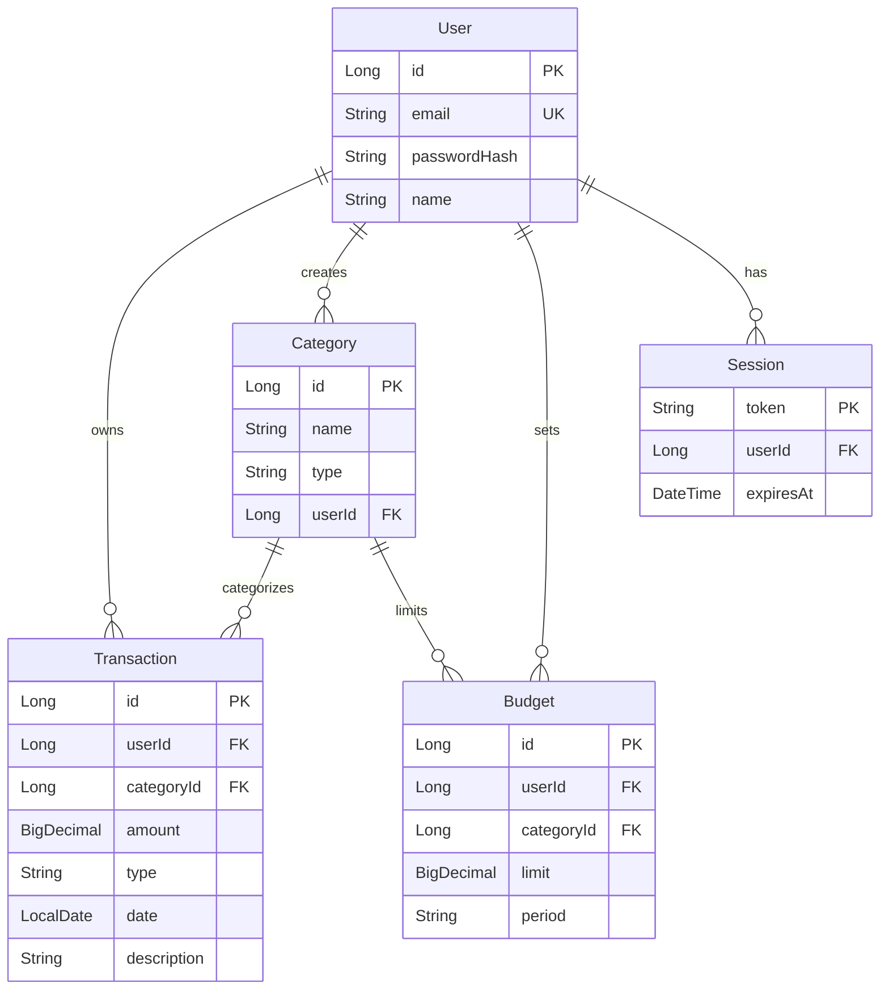

# Design Document

## Overview

The Expense Tracker Web Application is a full-stack financial management system built with a Spring Boot backend and Node.js frontend. The architecture follows a three-tier pattern: presentation layer (Node.js web dashboard), business logic layer (Spring Boot REST API), and data layer (MySQL database).

The system enables users to track income and expenses, categorize transactions, set budgets, and visualize spending patterns through reports and charts. Authentication ensures each user's financial data remains private and isolated.

Key design principles:
- RESTful API design for clear separation between frontend and backend
- Stateless authentication using session tokens
- Database-enforced referential integrity
- Client and server-side validation for data quality
- Responsive dashboard with real-time budget monitoring

## Architecture

### System Components

**Frontend Dashboard (Node.js)**
- Web-based user interface built with Node.js
- Renders dashboard, transaction forms, reports, and charts
- Performs client-side validation before API calls
- Handles user session management
- Communicates with backend via REST API

**Backend API (Spring Boot)**
- RESTful API service handling business logic
- Manages authentication and authorization
- Validates all incoming requests
- Performs calculations (budget utilization, spending trends, report aggregations)
- Interfaces with MySQL database via JPA/Hibernate

**Database (MySQL)**
- Stores users, transactions, categories, budgets
- Enforces referential integrity constraints
- Supports efficient querying with proper indexing
- Handles cascade deletes for data consistency

### Communication Flow



### Technology Stack

- **Backend**: Spring Boot 3.x, Spring Security, Spring Data JPA
- **Frontend**: Node.js, Express.js, templating engine (EJS/Handlebars)
- **Database**: MySQL 8.x
- **API Format**: JSON over HTTP/HTTPS
- **Authentication**: Session-based with secure cookies

## Components and Interfaces

### Authentication Service

**Responsibilities:**
- User registration with email uniqueness validation
- Credential verification for login
- Session creation and management
- Session expiration handling

**Interfaces:**
```java
interface AuthenticationService {
    UserSession register(String email, String password, String name);
    UserSession login(String email, String password);
    void logout(String sessionToken);
    User validateSession(String sessionToken);
}
```

### Transaction Service

**Responsibilities:**
- CRUD operations for transactions
- Transaction ownership validation
- Association with categories and users
- Query filtering by date, category, type

**Interfaces:**
```java
interface TransactionService {
    Transaction create(Long userId, TransactionRequest request);
    Transaction update(Long transactionId, Long userId, TransactionRequest request);
    void delete(Long transactionId, Long userId);
    List<Transaction> getByUser(Long userId, FilterCriteria filters);
    List<Transaction> search(Long userId, String searchTerm, FilterCriteria filters);
}
```

### Category Service

**Responsibilities:**
- Manage predefined and custom categories
- Category assignment to transactions
- Handle category deletion with transaction reassignment

**Interfaces:**
```java
interface CategoryService {
    List<Category> getPredefinedCategories();
    Category createCustom(Long userId, String name);
    void delete(Long categoryId, Long userId);
    List<Category> getByUser(Long userId);
}
```

### Budget Service

**Responsibilities:**
- CRUD operations for budgets
- Budget uniqueness validation (category + time period)
- Calculate budget utilization percentage
- Identify exceeded budgets

**Interfaces:**
```java
interface BudgetService {
    Budget create(Long userId, Long categoryId, BigDecimal limit, YearMonth period);
    Budget update(Long budgetId, Long userId, BigDecimal newLimit);
    void delete(Long budgetId, Long userId);
    List<BudgetStatus> getActiveBudgets(Long userId, YearMonth period);
    BigDecimal calculateUtilization(Long budgetId);
}
```

### Report Service

**Responsibilities:**
- Aggregate spending by category and date range
- Calculate income totals and net balance
- Generate budget comparison data
- Compute spending trends

**Interfaces:**
```java
interface ReportService {
    Map<Category, BigDecimal> getSpendingByCategory(Long userId, DateRange range);
    Map<Category, BigDecimal> getIncomeByCategory(Long userId, DateRange range);
    MonthlySummary getMonthlySummary(Long userId, YearMonth month);
    List<BudgetComparison> getBudgetComparison(Long userId, YearMonth period);
    SpendingTrend calculateTrend(Long userId, DateRange current, DateRange previous);
}
```

### REST API Endpoints

**Authentication**
- `POST /api/auth/register` - Create new user account
- `POST /api/auth/login` - Authenticate and create session
- `POST /api/auth/logout` - Terminate session

**Transactions**
- `POST /api/transactions` - Create transaction
- `GET /api/transactions` - List transactions with filters
- `GET /api/transactions/{id}` - Get single transaction
- `PUT /api/transactions/{id}` - Update transaction
- `DELETE /api/transactions/{id}` - Delete transaction
- `GET /api/transactions/search` - Search transactions

**Categories**
- `GET /api/categories` - List all categories (predefined + custom)
- `POST /api/categories` - Create custom category
- `DELETE /api/categories/{id}` - Delete custom category

**Budgets**
- `POST /api/budgets` - Create budget
- `GET /api/budgets` - List budgets with status
- `PUT /api/budgets/{id}` - Update budget
- `DELETE /api/budgets/{id}` - Delete budget

**Reports**
- `GET /api/reports/spending` - Spending by category
- `GET /api/reports/income` - Income by category
- `GET /api/reports/monthly-summary` - Monthly totals
- `GET /api/reports/budget-comparison` - Budget vs actual
- `GET /api/reports/trends` - Spending trends

**Dashboard**
- `GET /api/dashboard` - Aggregated dashboard data

## Data Models

### User Entity
```java
class User {
    Long id;
    String email;        // unique, not null
    String passwordHash; // bcrypt hashed
    String name;
    LocalDateTime createdAt;
    LocalDateTime updatedAt;
}
```

### Transaction Entity
```java
class Transaction {
    Long id;
    Long userId;         // foreign key to User
    Long categoryId;     // foreign key to Category
    BigDecimal amount;   // positive, max 10 digits
    TransactionType type; // INCOME or EXPENSE
    LocalDate date;      // not future date
    String description;
    LocalDateTime createdAt;
    LocalDateTime updatedAt;
}
```

### Category Entity
```java
class Category {
    Long id;
    String name;
    CategoryType type;   // PREDEFINED or CUSTOM
    Long userId;         // null for predefined, set for custom
}
```

Predefined categories: Food, Transportation, Housing, Utilities, Entertainment, Healthcare, Income, Other

### Budget Entity
```java
class Budget {
    Long id;
    Long userId;         // foreign key to User
    Long categoryId;     // foreign key to Category
    BigDecimal limit;    // positive, not zero
    YearMonth period;    // year and month
    LocalDateTime createdAt;
    LocalDateTime updatedAt;
    
    // Unique constraint on (userId, categoryId, period)
}
```

### Session Entity
```java
class Session {
    String token;        // UUID, primary key
    Long userId;         // foreign key to User
    LocalDateTime createdAt;
    LocalDateTime expiresAt;
}
```

### Database Relationships



### Database Indexes

- `User.email` - Unique index for login lookups
- `Transaction.userId` - Index for user transaction queries
- `Transaction.date` - Index for date range filtering
- `Transaction.categoryId` - Index for category filtering
- `Budget(userId, categoryId, period)` - Unique composite index
- `Session.token` - Primary key index
- `Session.expiresAt` - Index for cleanup queries


## Correctness Properties

*A property is a characteristic or behavior that should hold true across all valid executions of a system—essentially, a formal statement about what the system should do. Properties serve as the bridge between human-readable specifications and machine-verifiable correctness guarantees.*

### Property 1: User Registration Creates Account

*For any* valid registration data (unique email, valid password, name), submitting registration should result in a new user account being created in the database with the provided information.

**Validates: Requirements 1.1**

### Property 2: Authentication Round Trip

*For any* newly registered user, logging in with the correct credentials should create a valid session that can be used to access protected resources.

**Validates: Requirements 1.3, 1.5**

### Property 3: Invalid Credentials Rejected

*For any* login attempt with incorrect credentials (wrong password or non-existent email), the authentication service should return an error and not create a session.

**Validates: Requirements 1.4**

### Property 4: Transaction CRUD Round Trip

*For any* valid transaction data, creating a transaction, retrieving it, updating it, and then retrieving it again should reflect all changes accurately, and deleting it should make it no longer retrievable.

**Validates: Requirements 2.1, 2.3, 2.4**

### Property 5: Transaction Isolation

*For any* two different users, transactions created by one user should never appear in the transaction list of the other user.

**Validates: Requirements 2.2, 2.6**

### Property 6: Input Validation Rejects Invalid Data

*For any* transaction with invalid data (negative amount, amount exceeding 10 digits, future date, missing required fields), the backend should reject it with a descriptive validation error.

**Validates: Requirements 2.5, 10.1, 10.2, 10.3, 10.5**

### Property 7: Category Deletion Reassignment

*For any* custom category with associated transactions, deleting the category should result in all those transactions being reassigned to the "Other" category, and the transactions should remain accessible.

**Validates: Requirements 3.5**

### Property 8: Category Filtering

*For any* category and user, requesting transactions filtered by that category should return only transactions assigned to that category and belonging to that user.

**Validates: Requirements 3.4**

### Property 9: Budget CRUD Round Trip

*For any* valid budget data (category, positive amount, time period), creating a budget, retrieving it, updating the amount, and retrieving it again should reflect the changes, and deleting it should make it no longer retrievable.

**Validates: Requirements 4.1, 4.3, 4.4**

### Property 10: Budget Utilization Calculation

*For any* budget with associated expenses, the calculated utilization percentage should equal (total expenses in category / budget limit) × 100, and the budget should be marked as exceeded when utilization exceeds 100%.

**Validates: Requirements 4.5, 4.6, 6.3, 6.4, 6.5**

### Property 11: Budget Validation

*For any* budget with a negative or zero amount, the backend should reject it with a validation error.

**Validates: Requirements 10.4**

### Property 12: Spending Aggregation by Category

*For any* set of expense transactions within a date range, the spending report should group expenses by category and the sum of amounts in each category should equal the total of all expenses in that category.

**Validates: Requirements 5.1, 6.6**

### Property 13: Income Aggregation by Category

*For any* set of income transactions within a date range, the income report should group income by category and the sum of amounts in each category should equal the total of all income in that category.

**Validates: Requirements 5.2**

### Property 14: Monthly Balance Calculation

*For any* month with transactions, the monthly summary should show total income, total expenses, and net balance where net balance equals total income minus total expenses.

**Validates: Requirements 5.3, 6.1**

### Property 15: Budget Comparison Accuracy

*For any* budget with associated expenses in the budget period, the budget comparison report should show the budget limit and actual spending, where actual spending equals the sum of all expenses in that category during the period.

**Validates: Requirements 5.5**

### Property 16: Spending Trend Calculation

*For any* two time periods (current and previous), the spending trend should correctly calculate the percentage change between the periods: ((current - previous) / previous) × 100.

**Validates: Requirements 5.6**

### Property 17: Transaction Sorting

*For any* list of transactions, sorting by date should return transactions in chronological order, and sorting by amount should return transactions ordered by amount value.

**Validates: Requirements 6.2, 11.4, 11.5**

### Property 18: Cascade Delete Integrity

*For any* user with associated transactions, categories, and budgets, deleting the user should result in all associated data being deleted, and no orphaned records should remain.

**Validates: Requirements 7.4, 7.5**

### Property 19: Data Persistence Consistency

*For any* data modification operation (create, update, delete), a success response should only be returned after the changes have been committed to the database, ensuring the changes are immediately visible in subsequent queries.

**Validates: Requirements 7.1**

### Property 20: HTTP Status Code Correctness

*For any* API request, successful operations should return 2xx status codes (200 for retrieval/update, 201 for creation), client errors should return 4xx codes with error messages, and server errors should return 5xx codes.

**Validates: Requirements 8.2, 8.3, 8.4**

### Property 21: JSON Format Compliance

*For any* API request and response, the data should be valid JSON that can be parsed and serialized without errors.

**Validates: Requirements 8.5**

### Property 22: Schema Validation

*For any* incoming request payload that doesn't match the defined schema (wrong types, missing required fields, extra fields), the backend should reject it with a validation error.

**Validates: Requirements 8.6**

### Property 23: Date Range Filtering

*For any* start date and end date where start ≤ end, requesting transactions in that date range should return only transactions with dates between start and end inclusive.

**Validates: Requirements 9.1, 9.2, 9.3**

### Property 24: Invalid Date Range Rejection

*For any* date range where start date is after end date, the backend should reject the request with a validation error.

**Validates: Requirements 9.4**

### Property 25: Search Term Matching

*For any* search term, the search results should return only transactions where the description contains the search term (case-insensitive).

**Validates: Requirements 11.1**

### Property 26: Multi-Filter Conjunction

*For any* combination of filters (category, date range, transaction type), the results should include only transactions that match all specified criteria (AND logic).

**Validates: Requirements 11.2, 11.3**

### Property 27: Error Logging Completeness

*For any* error that occurs during request processing, the system should create a log entry containing timestamp, user context (if available), error message, and stack trace.

**Validates: Requirements 12.1**

### Property 28: Error Message Sanitization

*For any* error response returned to the client, the error message should be user-friendly and should not contain sensitive system information such as database connection strings, internal paths, or stack traces.

**Validates: Requirements 12.2**

### Property 29: Audit Logging

*For any* authentication attempt (successful or failed) and any data modification operation (create, update, delete), the system should create an audit log entry with timestamp, user identifier, operation type, and result.

**Validates: Requirements 12.3, 12.4**

### Property 30: Client-Side Validation

*For any* form submission with invalid data, the frontend should detect the validation errors and display error messages without making an API request to the backend.

**Validates: Requirements 10.6**

## Error Handling

### Error Categories

**Validation Errors (HTTP 400)**
- Missing required fields
- Invalid data types
- Out-of-range values (negative amounts, oversized amounts, future dates)
- Business rule violations (duplicate budgets, invalid date ranges)
- Response includes field-level error details

**Authentication Errors (HTTP 401)**
- Invalid credentials
- Expired session
- Missing authentication token
- Response includes generic error message (no credential hints)

**Authorization Errors (HTTP 403)**
- Attempting to access another user's data
- Attempting to modify resources without ownership
- Response indicates insufficient permissions

**Not Found Errors (HTTP 404)**
- Requested resource doesn't exist
- Transaction/budget/category ID not found
- Response indicates resource not found

**Conflict Errors (HTTP 409)**
- Duplicate email during registration
- Duplicate budget for same category/period
- Response indicates conflict reason

**Server Errors (HTTP 500)**
- Database connection failures
- Unexpected exceptions
- Response includes generic error message (no internal details)

### Error Response Format

All error responses follow a consistent JSON structure:

```json
{
  "error": {
    "code": "VALIDATION_ERROR",
    "message": "Invalid transaction data",
    "details": [
      {
        "field": "amount",
        "message": "Amount must be positive"
      }
    ],
    "timestamp": "2024-01-15T10:30:00Z"
  }
}
```

### Error Handling Strategy

**Backend Error Handling:**
- Global exception handler catches all exceptions
- Validation exceptions mapped to 400 responses
- Authentication exceptions mapped to 401 responses
- Authorization exceptions mapped to 403 responses
- Entity not found exceptions mapped to 404 responses
- Constraint violation exceptions mapped to 409 responses
- All other exceptions mapped to 500 responses
- All errors logged with full context
- Sensitive information stripped from client responses

**Frontend Error Handling:**
- Client-side validation before API calls
- Display field-level validation errors inline
- Display API errors in user-friendly format
- Retry logic for network failures
- Session expiration redirects to login
- Generic error page for unexpected failures

**Database Error Handling:**
- Connection pool with automatic retry
- Transaction rollback on errors
- Constraint violations caught and translated to business errors
- Deadlock detection and retry logic

### Logging Strategy

**Log Levels:**
- ERROR: All exceptions and failures
- WARN: Validation failures, authentication failures, authorization denials
- INFO: Successful authentication, data modifications, report generation
- DEBUG: Request/response details, query execution times

**Log Content:**
- Timestamp (ISO 8601 format)
- Log level
- User ID (if authenticated)
- Request ID (for tracing)
- Operation/endpoint
- Error message and stack trace (for errors)
- Execution time (for performance monitoring)

**Log Storage:**
- Application logs written to file system
- Log rotation daily with 30-day retention
- Audit logs stored in separate database table
- Critical errors trigger alerts

## Testing Strategy

### Dual Testing Approach

The testing strategy employs both unit testing and property-based testing to ensure comprehensive coverage:

**Unit Tests** focus on:
- Specific examples demonstrating correct behavior
- Edge cases (empty lists, boundary values, special characters)
- Error conditions and exception handling
- Integration points between components
- Concrete scenarios from requirements

**Property-Based Tests** focus on:
- Universal properties that hold for all inputs
- Comprehensive input coverage through randomization
- Invariants that must be maintained
- Round-trip properties (serialize/deserialize, create/retrieve)
- Relationship properties between operations

Together, these approaches provide complementary coverage: unit tests catch concrete bugs in specific scenarios, while property tests verify general correctness across a wide input space.

### Property-Based Testing Configuration

**Framework Selection:**
- Java backend: Use **jqwik** (JUnit 5 property-based testing)
- JavaScript frontend: Use **fast-check** (property-based testing for JavaScript)

**Test Configuration:**
- Minimum 100 iterations per property test (due to randomization)
- Each property test must include a comment tag referencing the design document
- Tag format: `// Feature: expense-tracker-web-app, Property {number}: {property_text}`
- Failed tests should report the minimal failing example for debugging

**Property Test Structure:**

```java
@Property
// Feature: expense-tracker-web-app, Property 4: Transaction CRUD Round Trip
void transactionCrudRoundTrip(@ForAll("validTransactions") Transaction transaction) {
    // Create
    Transaction created = transactionService.create(userId, transaction);
    assertNotNull(created.getId());
    
    // Retrieve
    Transaction retrieved = transactionService.getById(created.getId());
    assertEquals(created, retrieved);
    
    // Update
    transaction.setAmount(transaction.getAmount().add(BigDecimal.TEN));
    Transaction updated = transactionService.update(created.getId(), transaction);
    
    // Retrieve again
    Transaction retrievedAfterUpdate = transactionService.getById(created.getId());
    assertEquals(updated.getAmount(), retrievedAfterUpdate.getAmount());
    
    // Delete
    transactionService.delete(created.getId());
    
    // Verify deleted
    assertThrows(NotFoundException.class, 
        () -> transactionService.getById(created.getId()));
}
```

### Unit Testing Strategy

**Backend Unit Tests (JUnit 5 + Mockito):**
- Service layer tests with mocked repositories
- Controller tests with MockMvc
- Repository tests with H2 in-memory database
- Validation tests for all input constraints
- Security tests for authentication and authorization

**Frontend Unit Tests (Jest):**
- Component rendering tests
- Form validation tests
- API client tests with mocked responses
- State management tests
- Routing tests

**Integration Tests:**
- End-to-end API tests with TestContainers (MySQL)
- Authentication flow tests
- Multi-user isolation tests
- Database constraint tests
- Transaction rollback tests

### Test Coverage Goals

- Line coverage: minimum 80%
- Branch coverage: minimum 75%
- Property test coverage: all 30 correctness properties implemented
- Critical paths (authentication, transaction CRUD, budget calculations): 100% coverage

### Test Data Generation

**Property Test Generators:**
- Valid transactions: random amounts (0.01 to 999999.99), random dates (past year), random descriptions
- Valid users: random emails, random names, valid passwords
- Valid budgets: random positive amounts, random categories, random periods
- Invalid inputs: negative amounts, oversized amounts, future dates, empty strings, null values

**Unit Test Fixtures:**
- Predefined user accounts for consistent testing
- Sample transactions covering all categories
- Budget scenarios (under budget, at budget, over budget)
- Date range scenarios (current month, last month, custom ranges)

### Continuous Testing

- All tests run on every commit (CI/CD pipeline)
- Property tests run with 100 iterations in CI, 1000 iterations nightly
- Integration tests run in isolated Docker containers
- Performance tests run weekly to catch regressions
- Security tests (OWASP dependency check) run daily
